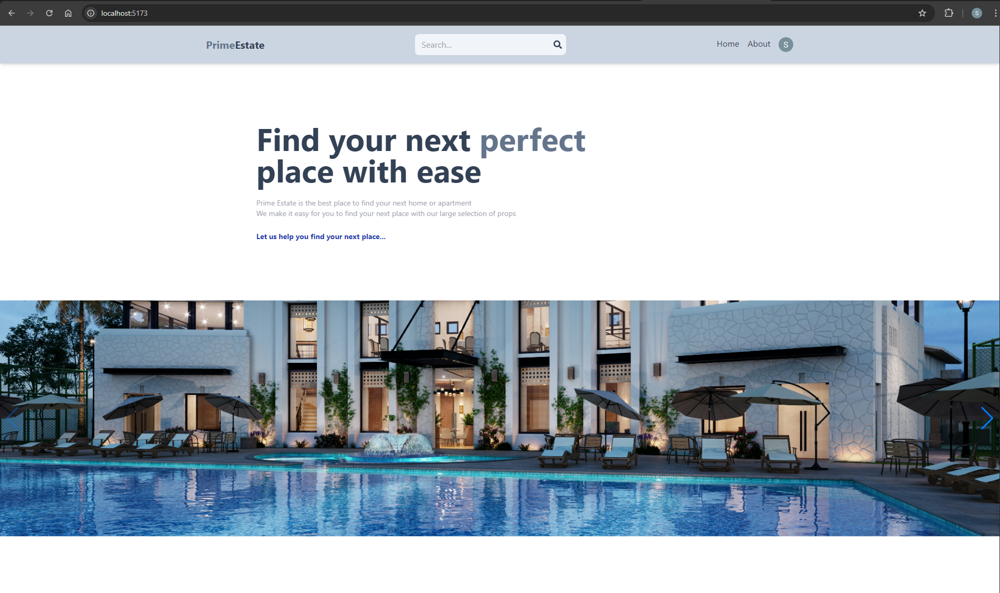
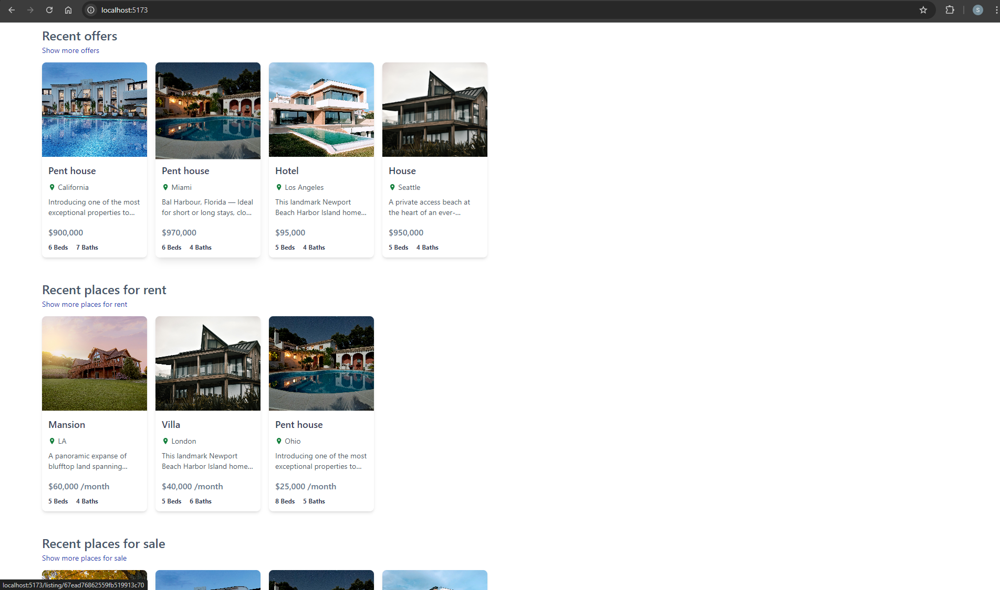
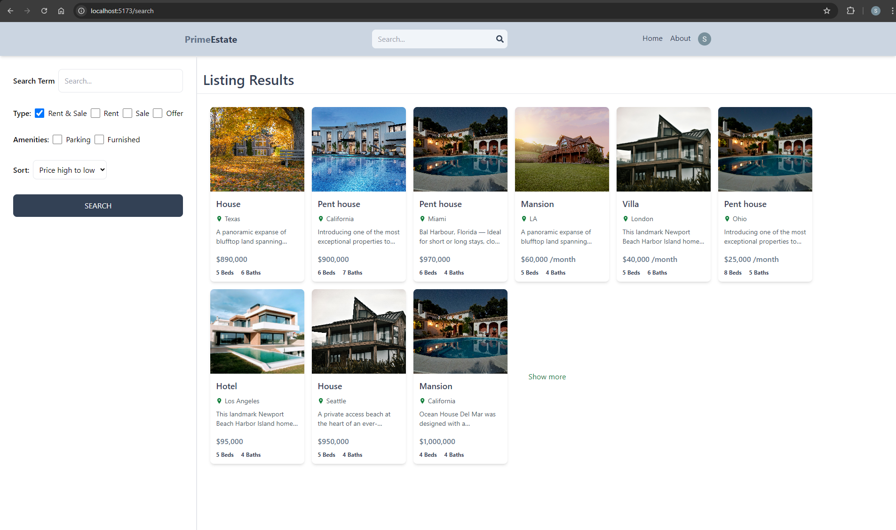
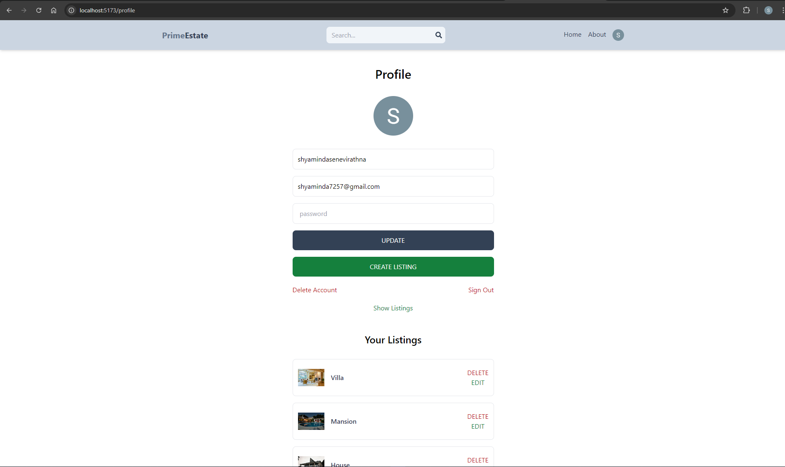
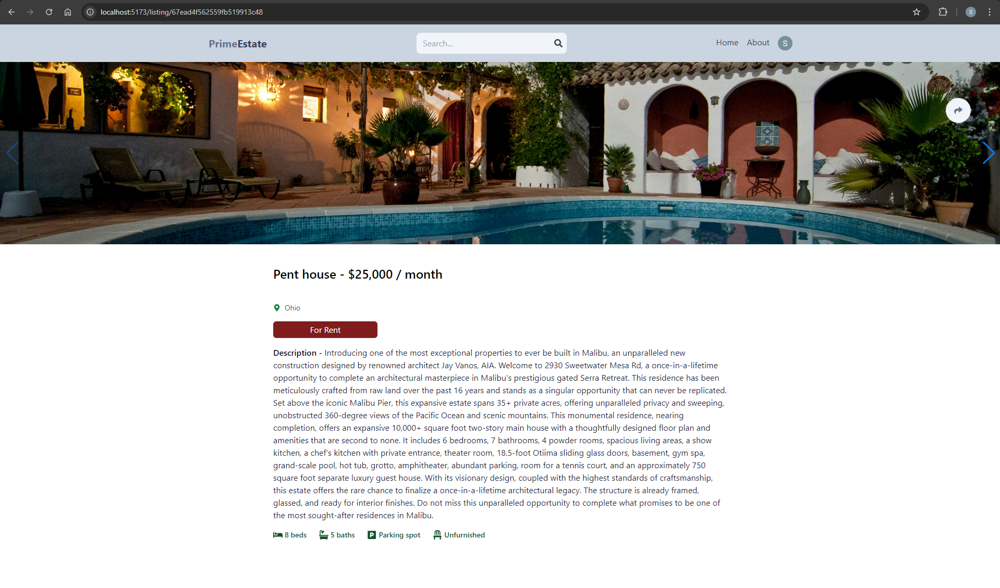
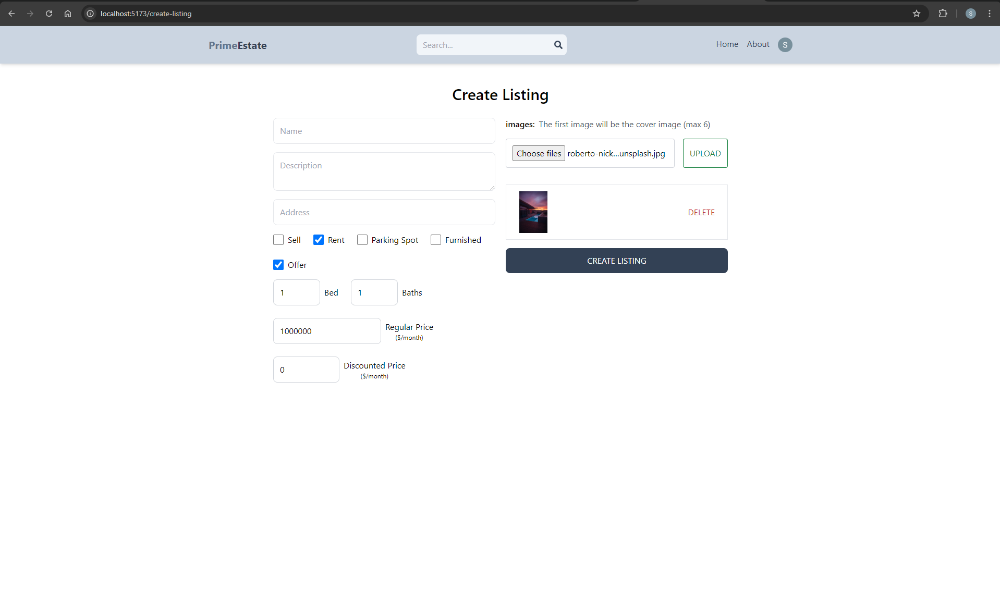

# 🏡 Real Estate App


## 📌 About the Project

A full-featured real estate platform where users can sign in, list their properties, and manage them. Users can post properties as **offers, sales, or rentals**, and these are dynamically displayed with filtering and search functionalities. Authentication supports **Google OAuth** and standard login. Users can also update their profile data and passwords.

---

## 📸 Project Screenshots

<details>
  <summary><strong>Home</strong></summary>
  
</details>

<details>
  <summary><strong>Home Listings</strong></summary>
  
</details>

<details>
  <summary><strong>Property Listings</strong></summary>
  
</details>

<details>
  <summary><strong>User Dashboard</strong></summary>
  
</details>

<details>
  <summary><strong>Property Details</strong></summary>
  
</details>

<details>
  <summary><strong>Listing</strong></summary>
  
</details>

---

## 📑 Index

- [Features](#-features)
- [Built With](#-built-with)
- [Installation](#-installation)
- [How It Works](#-how-it-works)
- [Support](#-support)
- [License](#-license)

---

## 🚀 Features

✅ **User Authentication**
- Sign in with **Google OAuth** or email/password
- Secure **JWT-based authentication**
- Update user data and passwords

✅ **Property Management**
- List properties as **Offers, Sales, or Rentals**
- **Dynamic display** of properties
- **Filtering and search** for easy discovery

✅ **Admin Controls**
- Manage user listings
- Remove or approve properties
- View all registered users

✅ **Additional Functionalities**
- Responsive **modern UI**
- Secure **data storage with MongoDB**
- Efficient **Redux state management**

---

## 🛠 Built With

- **Frontend**: React.js, Redux
- **Backend**: Express.js, Node.js
- **Database**: MongoDB
- **Authentication**: JWT, Firebase Google OAuth
- **State Management**: Redux

---

## 📦 Installation

### Running Locally

#### 1️⃣ Clone the repository

```sh
git clone https://github.com/Shyaminda/Real-Estate-App.git
cd real-estate-app
```

#### 2️⃣ Install dependencies

```sh
cd api && npm install
cd ../client && npm install
```

#### 3️⃣ Set up environment variables

Copy `.env.example` to `.env` and configure the following:

```env
MONGO="your-mongodb-uri"
JWT_SECRET="your-secret-key"
FIREBASE_API_KEY="your-firebase-api-key"
```

#### 4️⃣ Start the services

```sh
# Start the backend
cd api && npm run dev
```
Your backend will run at [http://localhost:3000](http://localhost:3000) 🚀

```sh
# Start the frontend
cd ../client && npm start
```
Your frontend will run at [http://localhost:5173](http://localhost:5173) 🚀

---

## 🔍 How It Works

1️⃣ **User Registration & Login**
- Sign up with Google OAuth or email/password
- Authenticate with JWT for secure sessions

2️⃣ **Adding Properties**
- Users list properties under **Offers, Sales, or Rentals**
- Properties dynamically appear on the homepage

3️⃣ **Filtering & Searching**
- Users can filter properties by **price, location, and type**
- Full-text search for quick property discovery

4️⃣ **User Controls**
- Users can update their **profile and password**
- Users manage **listings and users**

---

## 💡 Support

If you find this project useful, please consider giving it a ⭐ on GitHub.

---

## 📝 License

MIT License – Free to use and modify.

